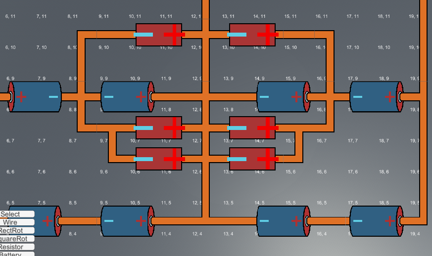
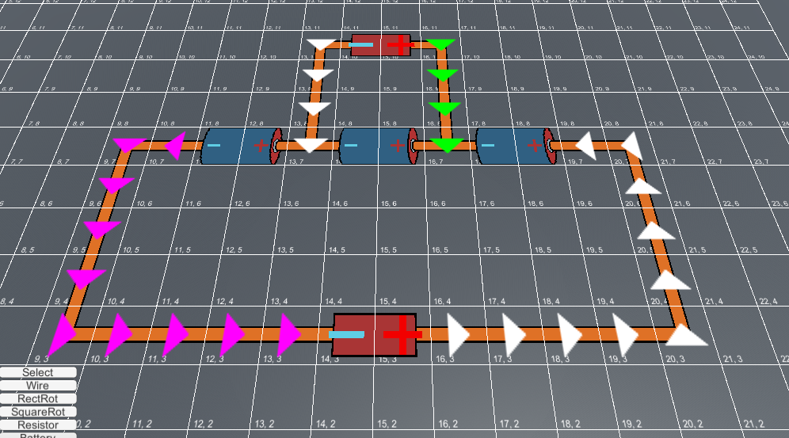
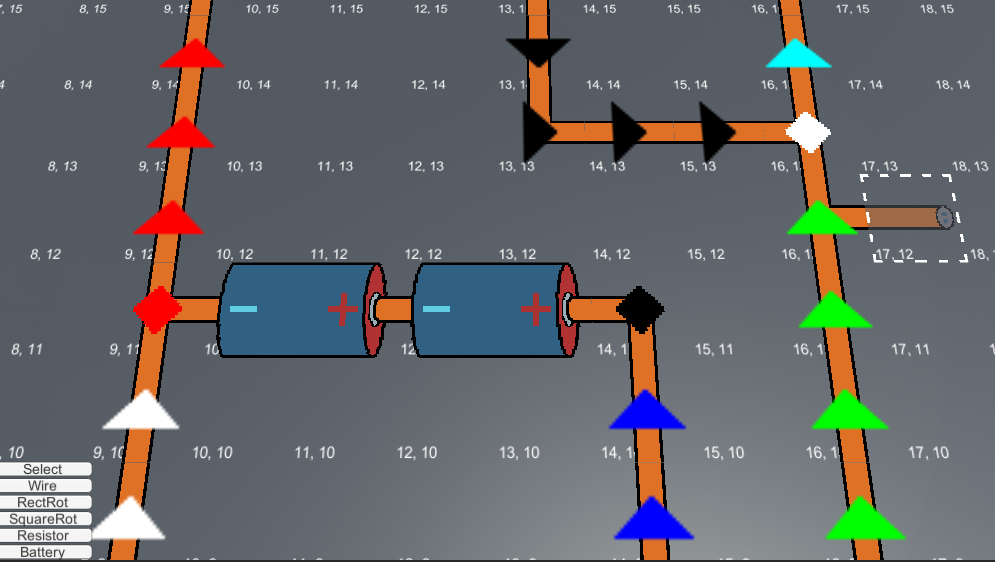

# CircuitBuilder

This repository contains C# scripts and sprite assets for my 2D circuit building game. 

# Scripts

Scripts can be found in the [Assets/Scripts](./Assets/Scripts) folder.

# Features

This game intends to be a physically accurate circuit building sandbox. Currently, no electromagnetism has been implemented and I am just working on the UI/sprite system.

I am building the logic for creating/merging circuits, where a circuit consists of junctions (nodes) and circuit segments (edges) and is thus a directed graph. Eventually, this will be used to implement physics, by using such a directed graph to solve Kirchoff's laws. 

Currently, the logic for merging and branching segments is in place, along with creation of junctions that join multiple segments. The sprite system for wires is in place, that decides the appropriate wire sprite to render based on the neighbouring entities. The system is grid based, with a wire piece taking up a single tile within the grid. Multi tile components (that can also be rotated) have also been implemented (with positive and negative terminal tile locations). 

# Screenshots

Below are some screenshots of the prototype

Wires and components

Circuit segments marked by coloured arrows

Logic for calculating wire segments and branches/junctions

